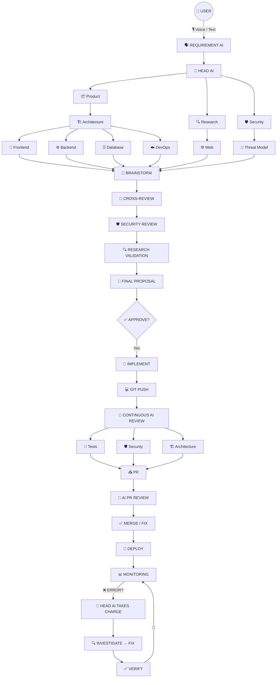

<div align="center">
  <h1>🚀 AI Engineering Organization</h1>
  <p><b>Complete Product Vision & Manifesto</b></p>
  <p><i>Instead of asking one AI to build your software, we give you an entire AI engineering company.</i></p>
</div>

---

## 📚 Project Documentation & Resources

Before diving into the core vision, please review our internal documentation for this project:
*   [**Architecture & Strategy Plan**](ARCHITECTURE_STRATEGY.md) - The 0-budget, open-source API routing blueprint detailing the model roster (GLM 5.2, DeepSeek V4, Kimi K3, MiniMax M3) and execution phases.
*   [**Team Onboarding & Git Guide**](TEAM_ONBOARDING_GIT_GUIDE.md) - The visual guide for new developers on how to use Git, branches, Pull Requests, and GitHub Actions safely without breaking the OS.

---

## 🌟 1. The Core Idea

Today, when someone wants to build an application using AI coding tools, they usually give a prompt to one AI.

> *"Build me an e-commerce application using React, Node.js and PostgreSQL."*

One model interprets the requirement, decides the architecture, chooses technologies, writes the code, and gives the result.

**The problem is obvious:** One AI is pretending to be an entire software company.

Our product changes this completely. Instead of one AI doing everything, the system creates a **virtual software engineering organization** made of multiple AI models and specialized AI agents.

The user gives the idea. The AI organization discusses it. Different AI specialists analyze different aspects. They research current information, brainstorm possible solutions, and challenge bad assumptions. A dedicated security team reviews the system from the beginning. A **Head AI** coordinates everyone. The system asks the human for decisions. Only after the architecture and requirements are agreed upon does implementation begin.

---

## 💡 2. The Philosophy

The product follows one fundamental principle:

> [!IMPORTANT]  
> **AI should not blindly build whatever the user asks. AI should help the user build the RIGHT thing.**

The system should be:
- 🛡️ **Honest & Security-first**
- 🌐 **Current & Context-aware**
- 📊 **Evidence-driven**
- 🤝 **Collaborative**
- ⚔️ **Willing to challenge the user & other AI agents**
- 🙋‍♂️ **Transparent about uncertainty & Human-controlled**

If the user is going in the wrong direction, the system should say so. If an AI agent is going in the wrong direction, the system should stop it. If the system doesn't know something, it should say: *"I don't have enough evidence to make this decision."* Instead of hallucinating.

---

## 🧠 3. The Head AI

At the center of everything is the **Head AI**. It acts like the engineering manager / technical leader of the virtual organization. It does not necessarily perform every task itself.

**Its job is to:**
* 🎯 Understand the user's goal & break the problem into tasks
* 👥 Assemble the right AI team & assign models to roles
* 🗣️ Coordinate brainstorming & detect conflicts
* ⚖️ Ask agents why they reached a conclusion & challenge weak reasoning
* 🔍 Request additional research
* 🛑 Stop agents going in the wrong direction
* ⬆️ Escalate important decisions to the user
* 💾 Track the entire project & maintain project memory
* 🛠️ Coordinate implementation, debugging, security, and testing
* 🔀 Coordinate Git/PR workflows & take charge during incidents

---

## 🏢 4. AI Teams

Instead of one model doing everything, the system creates specialized teams.

| Team | Responsibilities |
|---|---|
| 📦 **Product/Requirements** | Understands what the user actually wants. |
| 🏗️ **Solution Architecture** | Designs the overall system. |
| 🎨 **Frontend** | UI, UX, architecture, components, accessibility, state management, performance. |
| ⚙️ **Backend** | APIs, business logic, services, auth, scalability, error handling. |
| 🗄️ **Database** | Database selection, schema, relationships, indexing, queries, data lifecycle, scaling. |
| ☁️ **DevOps/Infrastructure** | Docker, CI/CD, deployment, infrastructure, monitoring, logging, cloud architecture. |
| 🧪 **Testing** | Unit tests, integration tests, E2E tests, regression tests, test coverage. |
| 🛡️ **Security** | Threat modeling, auth, secrets, injection, dependencies, API security, infrastructure security. |
| 🔍 **Research** | Checks current information from the internet and official documentation. |
| 📝 **Documentation** | Requirements, architecture, API, database, deployment, and security docs; project reports. |

---

## 🤖 5. Multiple AI Models Per Role

Suppose the platform has 20 available open/open-weight models. We don't force one model to do everything. The user can decide how models are distributed, providing different perspectives.

**Example Distribution:**
* 🎨 **Frontend:** Model A, Model B, Model C
* ⚙️ **Backend:** Model D, Model E
* 🗄️ **Database:** Model F
* 🛡️ **Security:** Model G, Model H, Model I
* 🏗️ **Architecture:** Model J, Model K

The user can choose models manually, or the system can auto-recommend based on *Task, Capability, Context length, Reasoning ability, Speed, Cost, Hardware, Benchmarks, and License.*

---

## 🏪 6. AI Model Marketplace / Registry

The platform maintains a registry of available models (e.g., Nemotron, Qwen, Gemma, Llama, Mistral) tracking:
*Provider, License, Size, Architecture, Context window, Tool-calling, Multimodal capability, Reasoning, Benchmarks, Hardware, Cost, and Local/Cloud availability.*

---

## 🗣️ 7. Brainstorming Instead of Debate

Agents don't fight; they **brainstorm**. They sit around a virtual table:

> **🏗️ Architect:** *"A modular monolith may be appropriate."*  
> **⚙️ Backend:** *"That simplifies deployment."*  
> **🛡️ Security:** *"But this authentication boundary needs modification."*  
> **🗄️ Database:** *"PostgreSQL is better because we have relational data."*  
> **☁️ DevOps:** *"A modular monolith will reduce infrastructure complexity."*  
> **🔍 Research:** *"Current framework documentation supports this approach."*

The Head AI synthesizes everything: *"After considering the available options, this architecture provides the best tradeoff."*

---

## ✅ 8. User Decisions Before Building

> [!WARNING]  
> The system should **not** immediately start coding.

After brainstorming, it asks the user for decisions:
*Frontend? Backend? DB? SQL or NoSQL? Cloud provider? Auth method? UI/UX style? Deployment target? Budget? Security? Local/Cloud inference?*

The user makes the decisions. The AI generates the approved specification. Only after approval: **`«BUILD»`**

---

## 🌐 9. Internet-Aware Intelligence

AI models have knowledge cutoffs, but technology changes constantly. Therefore, the platform has a **Research Layer**.

When a decision requires current info, the system searches:
1. Official documentation
2. Official repositories
3. Official announcements/changelogs
4. Primary technical sources

*e.g., AWS architecture → Research Agent checks current AWS documentation.*

---

## ⏳ 10. Freshness Awareness

The system knows when information needs to be current.

**Requires fresh verification:** API versions, Frameworks, Packages, Cloud services, Security vulnerabilities, Auth recommendations, Pricing, Deprecations.

---

## ⚖️ 11. Evidence-Based Decisions

Every important technical decision has an audit trail.

> **Decision:** Use PostgreSQL  
> **Reason:** Application contains strongly relational transactional data.  
> **Evidence:** Official PostgreSQL documentation, Current architecture research  
> **Alternatives considered:** MongoDB, MySQL (Rejected because...)  
> **Confidence:** High  
> **Reviewed by:** Architecture Agent, Database Agent, Security Agent

---

## 🛡️ 12. Security Is Not a Final Step

Security is present from the beginning.

* **Traditional:** Requirement ➔ Architecture ➔ Code ➔ Security review
* **Our System:** Requirement ➔ **Security consideration** ➔ Architecture ➔ **Security review** ➔ Code ➔ **Security review** ➔ Deployment security

### 13. Security Council
Security contains specialized agents coordinated by the Head AI:
*Threat Modeling, Application Security, API Security, Authentication, Authorization, Dependency Security, Secrets Detection, Infrastructure Security, Data Security.*

---

## 👁️‍🗨️ 14. AI Supervisor / Guardian

A supervisory layer asks: *"Are we actually going in the right direction?"*

It can stop:
- Dangerous technical choices
- Hallucinations or contradictory conclusions
- Insecure implementations
- Outdated technical recommendations

It forces: **Pause ➔ Investigate ➔ Revise ➔ Verify ➔ Continue**

---

## 🎭 15. Emotional / Social Intelligence

The system communicates naturally and doesn't blindly agree.
- **Wrong direction:** *"I don't recommend that."*
- **Misunderstanding:** *"There's an important distinction here."*
- **Uncertainty:** *"I'm not confident enough to recommend this yet."*

---

## 🎙️ 16. Voice-First Interaction

A voice experience where the user speaks naturally instead of typing.
> *"I want to build a Salesforce application where employees can submit requests and managers approve them."*

**Flow:** Speech ➔ Transcription ➔ Technical Requirement Extraction ➔ AI Council

---

## 💻 17. Screen Sharing & 18. Terminal Intelligence

- **Screen Sharing:** The AI understands visual context (IDE, Browser, Errors). It observes, understands, suggests, asks permission, and then acts.
- **Terminal Intelligence:** If `npm run dev` fails, the platform automatically understands the error and creates a structured issue instead of forcing copy-paste.

---

## 🏷️ 19. Problem / Issue Tagging

Every important problem gets a persistent identity.

```yaml
ID: SEC-014
Severity: CRITICAL
Category: Broken Authorization
Component: Backend API
File: users.ts
Detected by: Terminal Monitor
Agents: Backend, Security, Architecture
Status: BLOCKED
```

---

## 🐙 20. Git Integration & AI PR Reviews

Every `git push` triggers the **AI Engineering Pipeline**:
Code Review ➔ Architecture Review ➔ Security Review ➔ Dependency Review ➔ Performance Review ➔ Requirements Review ➔ AI Council.

> [!CAUTION]
> **Security as a PR Gate:** 
> - **CRITICAL:** Block PR
> - **HIGH:** Requires resolution / explicit override
> - **MEDIUM:** Warning
> - **LOW:** Informational

---

## 🚑 24. The Head AI Takes Charge During Errors

If the backend throws a 500 error in production, the Head AI takes ownership:

> **🧠 Head:** *"Backend team, what happened?"*  
> **⚙️ Backend:** *"The orders API is returning 500."*  
> **🧠 Head:** *"Why?"*  
> **⚙️ Backend:** *"Database connection timeout."*  
> **🧠 Head:** *"Database team, confirm."*  
> **🗄️ Database:** *"Confirmed. Connection pool is exhausted."*  
> **🧠 Head:** *"Why is the connection pool exhausted?"*  
> **⚙️ Backend:** *"A new code path isn't releasing connections."*  
> **🧠 Head:** *"Okay. Fix the connection lifecycle. Add a regression test. Run the full suite. Security re-check. Report back."*

*(This includes **25. Root-Cause Analysis** by repeatedly asking "Why?")*

---

## 💾 26. Continuous Project Memory

The system remembers Requirements, Architecture, Open issues, PR history, Previous failures, and User preferences.
> *"This change conflicts with the architecture we approved three weeks ago."*

---

## 📱 27. Mobile Companion & Remote Control

Seamless mobile access. The phone acts as a remote control.
> *"Head, what's happening?"*  
> *"Backend is healthy. Security has blocked PR #142 because of an authorization issue."*

Dangerous operations (Deployments, Merges) require explicit human confirmation.

---

## 🔄 29. The Complete Workflow



---

## ☁️ 30. Infrastructure & Model Routing

**Goal:** Maximum capability with minimum recurring cost.

The system supports model routing instead of forcing every task onto the most expensive model:
* **Simple classification:** Small local model
* **Complex architecture:** Strong reasoning model
* **Security analysis:** Security-capable model + second reviewer
* **Voice:** Speech model

---

## 🛑 32. The System Is Not “20 Chatbots”

We are NOT building "20 AI chat windows." We are building a **coordinated AI organization**. Models have Roles, Context, Memory, Review mechanisms, and Authority boundaries.

---

## 👑 33. Human Remains the Final Authority

The system is powerful, but the **human remains in control**. Important decisions require human approval (Architecture, Tech choices, Deployments, Destructive operations).

---

## 🚀 34. The Real Product Differentiator

The differentiator isn't: *"We use AI"* or *"We have multiple models."* 

It is:
> [!NOTE]  
> **We turn multiple AI models into a coordinated engineering organization that researches current information, brainstorms collaboratively, challenges bad decisions, enforces security, remembers the project, continuously reviews code, investigates failures, and communicates with the human across voice, desktop, screen, terminal, Git and mobile.**

---

## 🏁 35. The End Goal

Imagine a user saying: *"I want to build a Salesforce application for employee requests."*

The system says: *"Understood. I'm assembling the engineering council."*
The agents research, propose architectures, determine data needs, and identify threats. The Head AI consolidates and asks you for tech decisions. You choose.

> **«BUILD»**

The AI organization implements it. Every push is reviewed. Security watches. If a backend goes down, the Head AI takes charge, finds the root cause, fixes it, tests it, and reports back.

---

<div align="center">
  <h3>The One-Line Definition</h3>
  <p><i>An AI Engineering Operating System where a human collaborates with a dynamically assembled team of specialized AI models that research, brainstorm, architect, secure, build, review, debug, and continuously manage an entire software project.</i></p>
</div>
