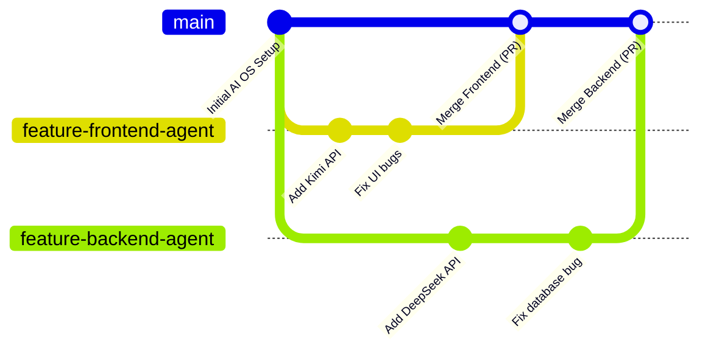
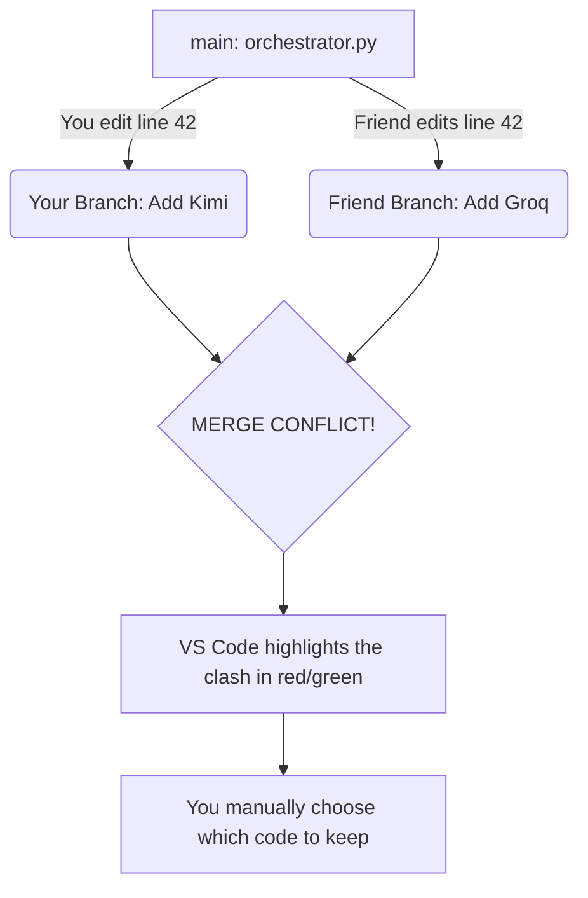
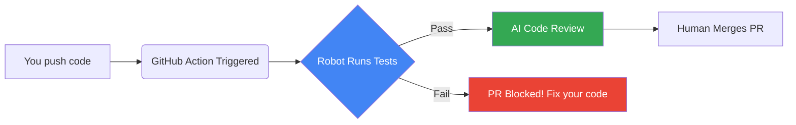

<div align="center">
  <h1>🤝 Team Onboarding: Git, GitHub & Pipelines</h1>
  <p><i>The visual guide to not breaking the AI OS!</i></p>
</div>

> [!IMPORTANT]
> **Welcome to the team!** Building the AI OS is a massive project. To prevent us from accidentally deleting each other's work, we use **Git** (our local "save game" system) and **GitHub** (the cloud where we combine our code).

---

## 🌳 1. The Branch System (Visualized)

Think of our project as a tree. The trunk is the `main` branch. 

> [!CAUTION]
> **Rule #1:** NEVER write code directly on the `main` branch. The `main` branch must always be 100% working, perfect code.

When you want to build a feature, you grow a new "branch". You do all your messy coding there, and when it's perfect, we "merge" it back to the trunk.



---

## 🔄 2. The Daily Workflow (Step-by-Step)

Follow this exact loop every time you sit down to code:

> [!TIP]
> **Step A: Sync up before starting**
> Download any code your teammates wrote while you were sleeping.
> ```bash
> git checkout main
> git pull origin main
> ```

> [!NOTE]
> **Step B: Create your workspace**
> Create a new branch for today's task.
> ```bash
> git checkout -b add-groq-api
> ```

> [!TIP]
> **Step C: Save your progress (Commit)**
> You wrote some code! Now, save a "snapshot" of it.
> ```bash
> git add .
> git commit -m "Connected Groq for fast brainstorming"
> ```

> [!IMPORTANT]
> **Step D: Upload to the cloud (Push)**
> Send your branch to GitHub so the rest of the team can see it.
> ```bash
> git push origin add-groq-api
> ```

---

## 💥 3. Merge Conflicts (The Enemy)

**What is a Merge Conflict?**
Imagine you and your teammate both edit line 42 of `orchestrator.py` at the same time. When you try to merge both branches into `main`, Git panics because it doesn't know which line 42 to keep. 



> [!WARNING]
> **How to avoid conflicts:**
> 1. **Communicate:** Say *"Hey, I'm working on `orchestrator.py` today!"* in the group chat.
> 2. **Pull often:** Always run `git pull origin main` before you start coding to ensure you have the latest code.
> 3. **Keep branches small:** Don't work on one branch for 3 weeks. Merge small features quickly.

---

## ⏪ 4. Going Back in Time (Time Travel)

If you break your code completely, Git allows you to time travel.

> [!NOTE]
> **Scenario 1: You haven't committed yet.**
> You wrote some terrible code but haven't run `git commit`. You just want the file to go back to exactly how it was this morning.
> ```bash
> git restore filename.py
> ```

> [!WARNING]
> **Scenario 2: You want to look at old code.**
> You want to see what the project looked like 3 days ago.
> ```bash
> # Find the commit ID (looks like 'a1b2c3d')
> git log
> 
> # Travel back in time to look at it (Read-only mode!)
> git checkout a1b2c3d
> 
> # Come back to the present
> git checkout main
> ```

> [!CAUTION]
> **Scenario 3: Undo a bad commit that is already on GitHub.**
> You pushed a bug to the team! Instead of deleting it (which causes issues), we create a *new* commit that acts as an "undo" button.
> ```bash
> git revert <bad-commit-id>
> git push
> ```

---

## 🤖 5. GitHub Actions & Pipelines (CI/CD)

Instead of humans doing boring work, we use **Pipelines** (automated robots). 



**Where we use Pipelines in the AI OS:**
1.  **Safety Net:** When you make a Pull Request, a robot will automatically run the Python code. If the code crashes, the Pull Request button turns red.
2.  **AI Code Reviewer:** We will build a pipeline so that every time you push code, our AI OS will automatically read your PR and look for security flaws or bugs before we even merge it.

---

### ⌨️ Terminal Cheat Sheet

| Command | Action |
| :--- | :--- |
| `git status` | Shows modified files and current branch. |
| `git add .` | Stages everything for a commit. |
| `git commit -m "msg"`| Saves the snapshot. |
| `git log` | Shows history of all commits. |
| `git pull` | Downloads latest updates from teammates. |
